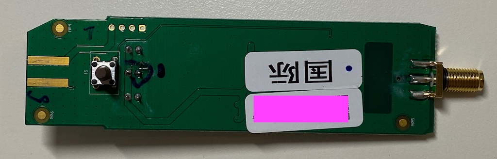

# Ginlong Solis solar inverters

## Preamble
[Ginlong Solis](https://www.ginlong.com/) is one of the world's recognised manufacturers of string solar inverters. Almost all of their products have an [RS-485 Modbus](https://en.wikipedia.org/wiki/RS-485) interface for reading the live status. This interface is used together with additional hardware to manage the devices online in the 'SolisCloud' (which is operated by [Alibaba China](https://www.alibabacloud.com/)).

## Solis S3 WiFi Data Logging Stick (3rd gen)

The WiFi stick is Solis' current solution for connecting the inverter to their cloud platform
(you can recognise the 3rd gen stick by the three LEDs on the front and the reset button on the back).

### Software

The firmware of the stick offers support for connecting the stick to the home WiFi and displays basic inverter statistics. The firmware (at least the current version `780034`) is a kind of beta and incomplete, as it lacks important functions that are available in the previous generation WiFi sticks. In particular, support for setting a second remote logging server (called "Server B") is missing.

The web interface is protected by HTTP simple auth with fixed username `admin` and password `123456789`. __After connecting the stick to your home WiFi the web password changes without notice to your WiFi password__. So you need to login to the web admin interface with `admin` and your WiFi password.
This somewhat wierd behaviour again shows the immature state of the firmware.

Since the current firmware does not support setting up your own remote logging server, there is [ginlong2influx.pl](ginlong2influx.pl) to read basic statistics from the web interface (`/inverter.cgi`) and publish this information in an influx db.

The stick firmware might be based on [MXCHIPS's MiCO OS](https://github.com/MXCHIP/mico-os)
(likely not the newer [MXCHIP's MXOS](https://github.com/MXCHIP/mxos)) embedded operating system.
It uses hardcoded DNS servers (`public1.alidns.com` and `public2.alidns.com`) and frequently pushes data to `*.iot-as-mqtt.eu-central-1.aliyuncs.com` (this server is likely chosen depending on your geolocation).

### Hardware

The stick hardware is based on [MXCHIP's](https://en.mxchip.com/) [EMW3080-E MCU](https://en.mxchip.com/productinfo/244846.html)
(ARM Cortex-M4F, 2.4G Hz IEEE 802.11 b/g/n WiFi, Suffix `-E` denotes `IPEX antenna, MX1290 processor`).
Datasheet: [V2.2](https://m.eleparts.co.kr/data/_gextends/good-pdf/202103/good-pdf-10094810-2.pdf).

The stick is connected to the inverter via a type of proprietary [Exceedconn](http://www.exceedconn.com/) [EC04681-2014-BF](http://www.exceedconn.com/e_products_detail.asp?id=76) connector (circular pin arrangement: 1=VCC=5V, 2=GND, 3=RS485+, 4=RS485-) .
The external antenna is connected via a standard [SMA connector](https://en.wikipedia.org/wiki/SMA_connector).
You can open [the case](ginlong-wifi-stick-s3-case.jpg) by pressing [the notches](ginlong-wifi-stick-s3-cap.jpg) towards the centre of the stick.




There is a serial interface (LogCLI) on the PCB connected to `UART2_Log_TX` and `UART2_Log_RX` of the MCU (115200 8N1, 3.3 Volt):
```
ROM:[V0.1]
FLASHRATE:4
BOOT TYPE:0 XTAL:40000000
IMG1 DATA[1128:10002000]
IMG1 ENTRY[800053d:100021ef]
IMG1 ENTER
CHIPID[000000ff]
read_mode idx:2, flash_speed idx:2
calibration_result:[1:19:13][3:15]
calibration_result:[2:21:11][1:15]
calibration_result:[3:1:1][1:1]
calibration_ok:[2:21:11]
FLASH CALIB[NEW OK]
OTA2 ADDR[8100000]
OTAx SELE[ffffffff]
OTA1 USE
IMG2 DATA[0x800f1c0:36:0x10005000]
IMG2 SIGN[RTKWin(10005008)]
IMG2 ENTRY[0x10005000:0x800b105]
BOOT_FLASH_RDP RDP enable
RDP bin decryption Failed!
checksum_ipsec = 0x46956286, checksum_rdp_flash = 0x80d838a
2ndboot image start

Press key 'w' to 2ndboot cli menu in 100ms.
122: ota crc cal:0x7a1a param:0xffff
17: ota upg_flag:0xffffcount:0 crc;0xffff
30: No OTA upgrade.
```

From the [full (anonymized) bootlog](ginlong-wifi-stick-s3-bootlog.txt) one can see that the circuit is based
on the [RTL8195A](https://www.realtek.com/en/products/communications-network-ics/item/rtl8195am) chip
which may suffer from [multiple security vulnerabilites](https://jfrog.com/blog/major-vulnerabilities-discovered-and-patched-in-realtek-rtl8195a-wi-fi-module/).

When holding the 'w' key during boot an extremely limited `2ndboot` CLI starts:

```
2ndboot image start 

Press key 'w' to 2ndboot cli menu in 100ms.
2ndboot ver: 2ndboot-1.0.0-20210917.200018
Please input 1-2 to select functions
[1] Uart Ymodem Upgrade 
[2] System Reboot 
[h] Help Info
2ndboot# h 
2ndboot ver: 2ndboot-1.0.0-20210917.200018
Please input 1-2 to select functions
2ndboot# 
```

When pulling TX pin 21 (`PA_30`) low during boot, the device waits for a xmodem
transfer (UART boot mode):

```
ROM:[V0.1]
FLASHRATE:4
UARTIMG_Download 2
Open xModem Transfer on Log UART...
```

One can find more info about the EMW3080 at
[A_D Electronics](https://web.archive.org/web/20220309073607/https://adelectronics.ru/2017/11/07/%D1%81%D1%85%D0%B5%D0%BC%D0%BE%D1%82%D0%B5%D1%85%D0%BD%D0%B8%D0%BA%D0%B0-%D0%B8-%D0%BE%D0%B1%D0%B7%D0%BE%D1%80-%D0%BC%D0%BE%D0%B4%D1%83%D0%BB%D1%8F-emw3080/)
and [a discussion at esp8266.ru](https://esp8266.ru/forum/threads/emw3080.3013/).

## Solis RS-485 documentation

[Dr. Brian Coghlan](https://www.scss.tcd.ie/Brian.Coghlan/) thankfully translated the Modbus [inverter communication protocol](https://www.scss.tcd.ie/Brian.Coghlan/Elios4you/RS485_MODBUS-Hybrid-BACoghlan-201811228-1854.pdf) from chinese to english.
