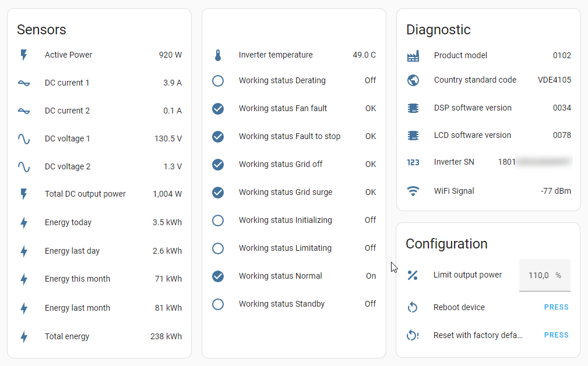
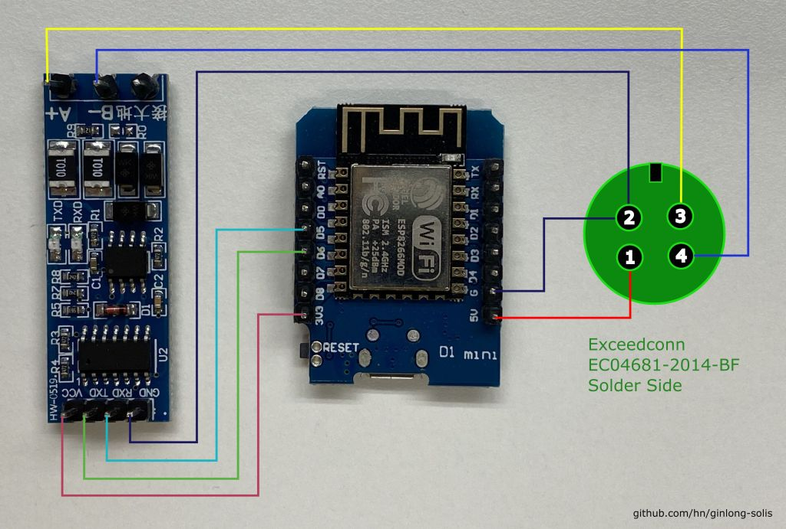
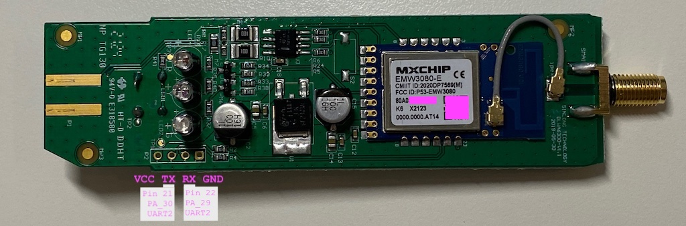

# Ginlong Solis solar inverters

## Preamble
[Ginlong Solis](https://www.ginlong.com/) is one of the world's recognised manufacturers of string solar inverters.
Almost all of their products have an [Modbus](https://en.wikipedia.org/wiki/Modbus) [RS-485](https://en.wikipedia.org/wiki/RS-485) interface for reading live status and statistics.

Quick start, you'll find here:
- [An ESPHome solution to integrate your inverter into Home Assistant, using an ESP8266](#software-esphome)
- [An ESPHome solution to integrate your inverter into Home Assistant, by replacing the firmware of the Solis S3 WiFi stick](#replacing-the-main-application)
- [An Arduino solution to push data from your inverter to InfluxDB, using an ESP8266](#software-arduino)
- [A wiring diagram for connecting the inverter to an ESP8266 via ModBus/RS485](#hardware)

The ESPHome solution also has some advanced features such as limiting the inverter output power, synchronising the inverter time via NTP and more.

If in doubt, I recommend choosing the Solis S3 stick with the alternative firmware. You can currently buy the Solis S3 stick for about 20 € and get a rugged, waterproof case, external antenna, etc. For this price you can not buy and assemble the individual parts.

Please do me a favor: :thumbsup: If you use any information or code you find here, please link back to this page.
:star: Also, please consider to star this project. I really like to keep track of who is using this to do creative things, especially if you are from other parts of the world.
:smiley: You are welcome to open an issue to report on your personal success project and share it with others.



## ESP8266 Solis interface

### Hardware

You need a proprietary [Exceedconn](http://www.exceedconn.com/) [EC04681-2014-BF](http://www.exceedconn.com/e_products_detail.asp?id=76) connector (available on Ebay) and an RS485-to-serial adapter (a [cheap one without DE/RE pins](https://arduino.stackexchange.com/questions/83501/when-it-comes-to-uart-to-rs485-communication-what-is-the-difference-between-the) is sufficient, e.g. the `HW-0519`, `XY-K485` or `XY-017`). Wire all components to e.g. a Wemos D1 mini (also available as 'pro' variant with an SMA connector and external antenna for better reception) as follows:



A bit strange, you have to [connect the RX pin of the `HW-0519` adapter to the RX pin of the ESP](https://arduino.stackexchange.com/a/83668) (and the TX pin to the TX pin), so no RX-TX-crossover like normal.

### Software (ESPHome)

Especially recommended if you use Home Assistant, [solis-esphome-esp8266.yaml](solis-esphome-esp8266.yaml) is an ready-to-use
configuration file for [ESPHome](https://esphome.io/), using an ESP8266. With the [ESPHome dashboard](https://esphome.io/guides/getting_started_hassio.html)
you can easily set up your system with just a few clicks via a user-friendly web interface.

### Software (Arduino)

With [solis2influx.ino](solis2influx.ino) one can read out all inverter data (status and statistics) via Modbus and push it to InfluxDB.
It uses [WiFiManager](https://github.com/tzapu/WiFiManager) to setup WiFi, so you have to connect to the `SOLIS2INFLUX` access point with your mobile phone first.

The reading of the data starts immediately after configuring WiFi. The data is not sent to the InfluxDB server until the inverter's serial number has been read, which may take a moment (the serial number is added as a mandatory tag to distinguish multiple inverters):

```
DC voltage 1 = 243.70V
DC current 1 = 0.90A
Inverter temperature = 22.50°C
Grid frequency = 49.98Hz
Writing to influxDB: solis,serialnumber=1801020221230123 DC\ voltage\ 1=243.70,DC\ current\ 2=0.90,Inverter\ temperature=22.5,Grid\ frequency=49.98
Energy last month = 234kWh
Energy today = 1.23kWh
Energy last day = 3.45kWh
Writing to influxDB: solis,serialnumber=1801020221230123 Energy\ last\ month=234i,Energy\ today=1.23,Energy\ last\ day=3.45
```

## Solis S3 WiFi Data Logging Stick (3rd gen)

The WiFi stick is Solis' current solution for connecting the inverter to their 'SolisCloud' platform
(which is operated by [Alibaba China](https://www.alibabacloud.com/)).
You can recognise the 3rd gen stick by the three LEDs on the front and the reset button on the back.

### Software

The firmware of the stick offers support for connecting the stick to the home WiFi and displays basic inverter statistics. The firmware (at least the current version `1012F`) is a kind of beta and incomplete, as it lacks important functions that are available in the previous generation WiFi sticks. In particular, support for setting a second remote logging server (called "Server B") is missing.

The web interface is protected by HTTP simple auth with fixed username `admin` and password `123456789`. __After connecting the stick to your home WiFi the web password changes without notice to your WiFi password__. So you need to login to the web admin interface with `admin` and your WiFi password.
This somewhat wierd behaviour again shows the immature state of the firmware.

Since the current firmware does not support setting up your own remote logging server, there is [solis2influx.pl](solis2influx.pl) to read basic statistics from the web interface (`/inverter.cgi`) and publish this information in an influx db.

The stick firmware is based on [Alibaba's AliOS-Things 3.0.0](https://github.com/alibaba/AliOS-Things/tree/rel_3.0.0) embedded operating system
(not sure if some parts of [MXCHIPS's MiCO OS](https://github.com/MXCHIP/mico-os) were been mixed in).
It uses [hardcoded DNS servers](https://github.com/alibaba/AliOS-Things/blob/rel_3.0.0/middleware/linkkit/wrappers/os/dns.c) (`public1.alidns.com` and `public2.alidns.com`) and frequently pushes data to `*.iot-as-mqtt.*.aliyuncs.com` (this server is chosen [depending on your geolocation](https://github.com/alibaba/AliOS-Things/blob/rel_3.0.0/middleware/linkkit/infra/infra_defs.c)).

### Hardware

The stick hardware is based on [MXCHIP's](https://en.mxchip.com/) [EMW3080-E MCU](https://en.mxchip.com/productinfo/244846.html)
(ARM Cortex-M4F, 2.4G Hz IEEE 802.11 b/g/n WiFi, Suffix `-E` denotes `IPEX antenna, MX1290 processor`).
Datasheet: [V2.2](https://m.eleparts.co.kr/data/_gextends/good-pdf/202103/good-pdf-10094810-2.pdf).

:raised_hand: Contrary to all available datasheets, the EMW3080-E (at least the one in my Solis S3 stick)
does *not* have 2MB flash installed, but an [8MB flash module](https://github.com/libretiny-eu/libretiny/issues/91#issuecomment-1480153212).

The EMW3080 is some kind of relabeled ([call it the same family](https://github.com/alibaba/AliOS-Things/blob/rel_3.0.0/board/mk3080/aos.mk))
[RTL8710BN](https://www.realtek.com/en/products/communications-network-ics/item/rtl8710bn) MCU (Ameba-Z series).
One can find more info about the EMW3080 at
[A_D Electronics](https://web.archive.org/web/20220309073607/https://adelectronics.ru/2017/11/07/%D1%81%D1%85%D0%B5%D0%BC%D0%BE%D1%82%D0%B5%D1%85%D0%BD%D0%B8%D0%BA%D0%B0-%D0%B8-%D0%BE%D0%B1%D0%B7%D0%BE%D1%80-%D0%BC%D0%BE%D0%B4%D1%83%D0%BB%D1%8F-emw3080/)
and [a discussion at esp8266.ru](https://esp8266.ru/forum/threads/emw3080.3013/).

The stick is connected to the inverter via a type of proprietary [Exceedconn](http://www.exceedconn.com/) [EC04681-2014-BF](http://www.exceedconn.com/e_products_detail.asp?id=76) connector (circular pin arrangement: 1=VCC=5V, 2=GND, 3=RS485+, 4=RS485-) .
The external antenna is connected via a standard [SMA connector](https://en.wikipedia.org/wiki/SMA_connector).
You can open [the case](solis-wifi-stick-s3-case.jpg) by pressing [the notches](solis-wifi-stick-s3-cap.jpg) towards the centre of the stick.




There is a serial interface (LogCLI) on the PCB connected to `UART2_Log_TX` and `UART2_Log_RX` of the MCU (115200 8N1, 3.3 Volt).

Update: Since end of 2022 there is a [new PCB version which contains a hardware watchdog](https://github.com/hn/ginlong-solis/issues/13#issuecomment-1636475754).
You can recognize these new boards by the silkscreen '22.34' (which probably corresponds to the year and week of manufacture) .

### Analysis via the serial port

You get a first impression when you examine the `UART2_Log` output:

```
ROM:[V0.1]
FLASHRATE:4
BOOT TYPE:0 XTAL:40000000
IMG1 DATA[1128:10002000]
IMG1 ENTRY[800053d:100021ef]
IMG1 ENTER
CHIPID[000000ff]
read_mode idx:2, flash_speed idx:2
calibration_result:[1:19:13][3:15]
calibration_result:[2:21:11][1:15]
calibration_result:[3:1:1][1:1]
calibration_ok:[2:21:11]
FLASH CALIB[NEW OK]
OTA2 ADDR[8100000]
OTAx SELE[ffffffff]
OTA1 USE
IMG2 DATA[0x800f1c0:36:0x10005000]
IMG2 SIGN[RTKWin(10005008)]
IMG2 ENTRY[0x10005000:0x800b105]
BOOT_FLASH_RDP RDP enable
RDP bin decryption Failed!
checksum_ipsec = 0x46956286, checksum_rdp_flash = 0x80d838a
2ndboot image start

Press key 'w' to 2ndboot cli menu in 100ms.
122: ota crc cal:0x7a1a param:0xffff
17: ota upg_flag:0xffffcount:0 crc;0xffff
30: No OTA upgrade.
```

See the [full (anonymized) bootlog](solis-wifi-stick-s3-bootlog.txt) for more details.

When holding the 'w' key during boot an extremely limited [2ndboot](https://github.com/alibaba/AliOS-Things/tree/rel_3.0.0/middleware/uagent/ota/2ndboot) CLI starts:

```
2ndboot image start 

Press key 'w' to 2ndboot cli menu in 100ms.
2ndboot ver: 2ndboot-1.0.0-20210917.200018
Please input 1-2 to select functions
[1] Uart Ymodem Upgrade 
[2] System Reboot 
[h] Help Info
2ndboot# h 
2ndboot ver: 2ndboot-1.0.0-20210917.200018
Please input 1-2 to select functions
2ndboot# 
```

When pulling TX pin 21 (`PA_30`) low during boot, the device waits for a xmodem
transfer (`UART boot mode`):

```
ROM:[V0.1]
FLASHRATE:4
UARTIMG_Download 2
Open xModem Transfer on Log UART...
```

When the device is in this mode, one can download the firmware using
[RTLtool](https://github.com/pvvx/RTL0B_SDK/blob/master/mkb/rtltool.py) (depends on Python2)
(Update: [ltchiptool](https://github.com/libretiny-eu/ltchiptool) is now a better option):

```
$ python2 ./rtltool.py -p /dev/ttyUSB0 gf
Connecting...
Flash Status value: 0x40
$ python2 ./rtltool.py -p /dev/ttyUSB0 rf 0x8000000 0x800000 dump-0x8000000-0x800000.bin
Connecting...
Read Flash data from 0x08000000 to 0x08800000 in file: dump-0x8000000-0x800000.bin ...
Done!
```

### Analysis of the memory content (firmware 1012F)

The dump contains all kinds of interesting stuff (`AOS-R-3.0.0` and `sdk-c-3.0.1` clearly link to AliOS-Things 3.0.0).
With the help of [Realtek AmebaZ Memory Layout](https://raw.githubusercontent.com/ambiot/amb1_sdk/master/doc/UM0111%20Realtek%20Ameba-Z%20memory%20layout.pdf),
[Introduction to Ameba-Z SDK](https://raw.githubusercontent.com/ambiot/amb1_sdk/master/doc/UM0112%20Realtek%20Ameba-Z%20SDK%20quick%20start.pdf)
and [mk3080/flash_partitions.c](https://github.com/alibaba/AliOS-Things/blob/rel_3.0.0/board/mk3080/flash_partitions.c)
one can reconstruct the flash partition table found at address `0x800e320`:

```
DESCRIPTION     START_ADDR    LENGTH
Bootloader      0x0           0x8000        // = AliOS-Things/platform/mcu/rtl8710bn/bin/boot_all.bin
Recovery        0xb000        0x6000        // 2ndboot
Application     0x19000       0x127000
OTA Storage     0x150000      0x127000
Parameter1      0x2a0000      0x2000
Parameter2      0x2a2000      0x2000        // WiFi credentials @ 0x2a3000
Parameter3      0x2a4000      0x2000        // AliOS PK+PS+DN+DS
Parameter4      0x2a6000      0x2000
Parameter5      0x2a8000      0x10000
Parameter55     0x2b8000      0x1000
Parameter33     0x7fe000      0x1000        // Backup of Parameter3 ?
Offline         0x300000      0x4fe000      // 0x1000 zeros + some noise
```

### Playing with the Alibaba IOT Platform

Partition 'Parameter3' contains the 'Product Key' (PK) and 'Device Secret' (DS)
needed to connect to the [Alibaba IOT Platform](https://www.alibabacloud.com/help/en/iot-platform/latest/establish-a-connection-between-a-device-and-iot-platform).
The serial number of the stick is used as 'Device Name' (DN).
With the [Link SDK for Python](https://www.alibabacloud.com/help/en/iot-platform/latest/link-sdk-for-python)
you can easily impersonate as the inverter and send MQTT data to the SolisCloud.

### Analysis of the main application (firmware 1012F)

The main application starts at `0x19000` with a `TEXT` segment for
flash in place execution (XIP). It is followed by a `DATA`
segment for RAM execution. I will refer to this part as 'APP1'.

The complete APP1 in OTA package format (including checksums) starts
at `0x19000` with length 797628 and MD5 checksum `0a88cb5556ab28ffba63a8d56e131d56`.
With [decode-alios-ota-firmware.pl](decode-alios-ota-firmware.pl) one can
view all details and validate the checksums:

```
$ ./decode-alios-ota-firmware.pl solis-s3-app-1012F_ota.bin
# Segment .text
  0x00000000:  Signature        = 0x3831393538373131 (OK)
  0x00000008:  Code length      = 790112
  0x0000000c:  Address          = 0x00000000 (FLASH XIP)
  0x00000010:  Reserved         = 0xffffffffffffffffffffffffffffffff
  0x00000020:  Code             = (byte code)

# Segment .data
  0x000c0e80:  Signature        = 0x3831393538373131 (OK)
  0x000c0e88:  Code length      = 7420
  0x000c0e8c:  Address          = 0x10005000 (RAM)
  0x000c0e90:  Reserved         = 0xffffffffffffffffffffffffffffffff
  0x000c0ea0:  Code             = (byte code)

# Segments checksum
  0x000c2b9c:  Checksum         = 0x25249404 (OK)

# OTA trailer
  0x000c2ba0:  Magic            = 0xefefefef (OK)
  0x000c2ba4:  Size             = 797600 (OK)
  0x000c2ba8:  MD5 checksum     = 0x85a615f88804cfb7784ffab81c27795b (OK)
  0x000c2bb8:  Reserved         = 0xffffffff

# End of data
  0x000c2bbc:  Filesize         = 0xc2bbc = 797628 (OK)

```

Somewhat unexpectedly, the APP1 part is followed by a second app ('APP2') starting
with `TEXT` at `0xdbbbc` (length 222276) and `DATA` at `0x112020` (length 3656).
This APP2 is binary identical to [AliOS ate.bin](https://github.com/alibaba/AliOS-Things/blob/rel_3.0.0/board/mk3080/ate.bin).
It is currently not clear whether it is being used at all, there is a suspicion
that it is an ATE firmware for [Automatic test equipment](https://en.wikipedia.org/wiki/Automatic_test_equipment)
or to set [eFuses](https://en.wikipedia.org/wiki/EFuse)/RDP.

### Tampering with the main application (firmware 1012F)

With knowledge of the source code it is easy to locate the corresponding byte code in the dump.
For example, the [Mbed TLS](https://github.com/Mbed-TLS/mbedtls)
[wrapper code](https://github.com/alibaba/AliOS-Things/blob/rel_3.0.0/middleware/linkkit/wrappers/os/HAL_TLS_mbedtls.c)

```
if (ca_crt != NULL) {
   mbedtls_ssl_conf_authmode(&(pTlsData->conf), MBEDTLS_SSL_VERIFY_REQUIRED);
```

corresponds to the binary

```
0803fb86 ba f1 00 0f     cmp.w      r10,#0x0
0803fb8a 2f d0           beq        LAB_0803fbec
0803fb8c 02 21           movs       r1,#0x2		// 0x2 = MBEDTLS_SSL_VERIFY_REQUIRED
0803fb8e 2e e0           b          LAB_0803fbee
```

So, if you change value `02 21` to `00 21` (0x0 = `MBEDTLS_SSL_VERIFY_NONE`) at offset `0x3fb8c`,
the destination SSL certificate will not be checked anymore and you can man-in-the-middle or
redirect the SSL traffic (MQTT, HTTP, ... to Alibaba cloud).

When writing to the flash with RTLtool (`wf` cmd), make sure to always write
full 4096 bytes aligned data blocks (flash `SECTOR_SIZE 0x1000`).

:warning: Warning: Obviously writing to the flash memory is dangerous and may
permanently damage your device.

### Replacing the main application

Thanks to the fine folks at [LibreTiny](https://github.com/libretiny-eu/libretiny), arduino-compatible cores
for RTL8710B chips are available. And even better, LibreTiny is [now part of ESPHome](https://esphome.io/changelog/2023.9.0.html).
With [solis-esphome-emw3080.yaml](solis-esphome-emw3080.yaml) you can read out all
relevant status and statistics data from your Solis inverter and push it to Home Assistant.

Install the ESPHome firmware for the S3 stick as follows:

1. Install the [ESPHome dashboard](https://esphome.io/guides/getting_started_hassio.html#installing-esphome-dashboard) for Home Assistant (at least version 2023.9.0).
1. If you not already have one, add a `secrets.yaml` to the ESPHome addon, containing at least `wifi_ssid`, `wifi_password`, `wifi_ap_ssid`, `wifi_ap_password`, `api_encryption_key` and `ota_password`.
1. Add [solis-esphome-emw3080.yaml](solis-esphome-emw3080.yaml) to the ESPHome addon.
1. Depending on your inverter type, copy one of [solis-modbus-inv.yaml](solis-modbus-inv.yaml) or [solis-modbus-esinv.yaml](solis-modbus-esinv.yaml) as well.
1. Within `solis-esphome-emw3080.yaml` edit inverter type (`include` statement within `packages` section).
1. Click the three-dots button, then "Install" and "Manual Download".
1. Wait for the compilation process to finish and download the "UF2 package".
1. Set the MCU to `UART boot mode` ([pull TX pin low during boot](https://github.com/hn/ginlong-solis/issues/9) -- you do not need to solder,
   just [inserting some jumper wires](https://github.com/hn/ginlong-solis/issues/9#issuecomment-1595643051) is sufficient).
   Make sure your serial adapter uses 3.3V voltage, read the notes below carefully about possible challenges with these adapters.
1. Backup the stock firmware with [ltchiptool](https://github.com/libretiny-eu/ltchiptool) (also available as a Win GUI version):
   ```
   $ ltchiptool -V
   ltchiptool v4.10.1 # use at least this version
   $ ltchiptool flash read -d /dev/ttyUSB0 RTL8710B solis-s3-firmware-1012f.bin
   I: Connecting to 'Realtek AmebaZ' on /dev/ttyUSB0 @ 1500000
   I: Reading Flash (8 MiB)
   $ ls -l solis-s3-firmware-1012f.bin
   8388608 # file size should be exactly this, otherwise something has gone wrong
   ```
1. Flashing the ESPHome image (replacing stock AliOS 2ndboot and main app altogether) is as simple as
   ```
   $ ltchiptool flash write -d /dev/ttyUSB0 solis-emw3080.uf2
   ```

After flashing, you can reconnect the S3 WiFi stick to the inverter and the status data will magically appear in Home Assistant.
For subsequent updates you can simply OTA-upload the firmware via the ESPHome addon.

:warning: Warning: Obviously writing to the flash memory is
dangerous and may permanently damage your device. Be careful and keep children away.

:warning: It is recommended to use a [good](https://zeptobars.com/en/read/FTDI-FT232RL-real-vs-fake-supereal) FTDI FT232RL USB serial adapter
for dumping and flashing. Other adapters may have [problems with the required high transfer rate](https://github.com/hn/ginlong-solis/issues/9#issuecomment-1604134701).
In some cases, the serial adapter or USB port does not supply enough power to flash the stick, then try a different adapter or USB port.

:bulb: This integration uses a [patched](libretiny-ringbuffer-workaround.diff) version of
the [ArduinoCore-API](https://github.com/hn/ArduinoCore-API). This workaround is necessary until https://github.com/libretiny-eu/libretiny/issues/154 is fixed.

:bulb: Matching the EMW3080 datasheet, one should actually use the `generic-rtl8710bn-2mb-788k` board profile
for LibreTiny. But since the Solis WiFi stick has a special 8MB version of the MCU with an OTA address of 0x100000, the
not exactly matching profile `generic-rtl8710bx-4mb-980k` is used here, manually [setting the MCU type and frequency in
the PlatformIO options to the correct value](https://github.com/libretiny-eu/libretiny/issues/91#issuecomment-1476792864).

## Solis Modbus Register Map and RS-485 documentation

Solis products feature (at least) two different Modbus register maps, the
`ESINV` (energy storage inverter) map mostly uses registers in the 3xxxx (ten-thousands) range
and the `INV` (inverter) map uses the 3xxx (thousands) range.
It is probably a good practice (not thoroughly tested) to query register 35000 ("inverter type definition")
and act according to the first two _decimal_ places of the read value
(the documentation says: "high 8 bit means protocol version, low 8 bit means inverter
model", but I think this is only correct if you interpret it as some kind of 'decimal bits'):

- `10`: see [RS485_MODBUS (INV-3000IDEPM-36000ID) inverter protocol](https://ginlongsolis.freshdesk.com/helpdesk/attachments/36112313359)
- `20`: see [RS485_MODBUS (ESINV-33000ID) energy storage inverter protocol](https://forum.iobroker.net/assets/uploads/files/1619515984065-_without-control-hybrid-en-2020.9.15_rs485_modbus-esinv-33000id-hybrid-inverter.pdf)

For the `INV` 3xxx Register Map, you'll need to subtract offset 1 from addresses
before transmitting on the bus (see explanation in section 5.3 of the
document).

[Dr. Brian Coghlan](https://www.scss.tcd.ie/Brian.Coghlan/) initially translated the
`ESINV`-Modbus [inverter communication protocol](https://www.scss.tcd.ie/Brian.Coghlan/Elios4you/RS485_MODBUS-Hybrid-BACoghlan-201811228-1854.pdf) from chinese to english in 2018,
but it now seems to me to have been superseded by the official versions from Solis linked above.

## Misc

- According to [Serial Number Naming Rule](https://ginlongsolis.freshdesk.com/support/solutions/articles/36000044079-serial-number-naming-rule)
  and [Ginlong Solis Serial Number decoder V1.1.pdf](https://ginlongsolis.freshdesk.com/helpdesk/attachments/36042847221)
  Solis inverter serial numbers consist of 12 or 15 digits. Supplemented by [helpful comments](https://github.com/hn/ginlong-solis/issues/1),
  the following extended syntax can be derived::
  ```
         MM-0-YYMDD-SSSS (12 digit style)
   D-O-0-MM-0-YYMDD-SSSS (15 digit style)
  D-O-0-MMM-0-YYMDD-SSSS (16 digit style)
  ```

- Curiously, the HTML source files of the Solis S3 WiFi stick can be found in [this repository](https://github.com/c45449210/fs).

## Credits

- [kuba2k2](https://github.com/kuba2k2) for LibreTiny und for patiently helping with problems and patches.

- [jimmyburnworld](https://github.com/jimmyburnworld/) implemented [a similiar approach for Solis ESINV inverters](https://github.com/jimmyburnworld/SolisModbus-MQTT)
  and [MalteSchm](https://github.com/MalteSchm/) updated it [for Solis INV inverters](https://github.com/MalteSchm/SolisModbus-MQTT).

- [incub77](https://github.com/incub77/) offers [a comprehensive solution based on the Raspberry Pi](https://github.com/incub77/solis2mqtt)

- How could it be otherwise than that Tasmota also offers [a solution for Modbus inverters](https://github.com/arendst/Tasmota/blob/master/tasmota/tasmota_xnrg_energy/xnrg_29_modbus.ino).

